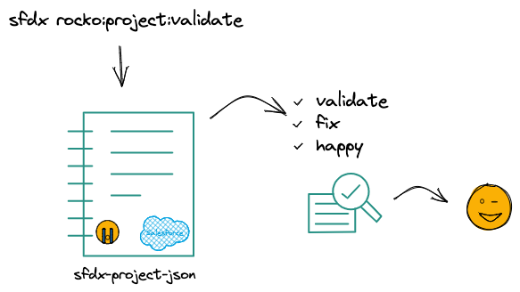
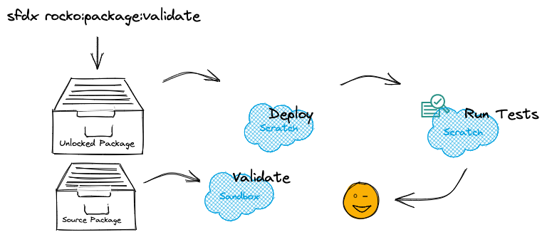

@rocko1204/rocko-sfdx
=====================

## sfdx supporter for your daily work with packages 

[](https://npmjs.org/package/@rocko1204/rocko-sfdx)
[](https://npmjs.org/package/@rocko1204/rocko-sfdx)
[](https://github.com/github/rocko-sfdx/blob/master/package.json)


how to install

```sh-session
$ sfdx plugins:install @rocko1204/rocko-sfdx
...
```


This command performs static checks in the sfdx-project json file for changed packages. Optional flags are used to control which validations are to be carried out. The individual tests are described with the flags.
See code: [src/commands/rocko/project/validate.ts](https://github.com/github/rocko-sfdx/blob/v0.0.1/src/commands/rocko/project/validate.ts)
```
USAGE
  $ sfdx rocko:project:validate [-s <string>] [-v -t <string>] [-m] [-o] [-d] [-i <string>] [-e 
  <string>] [-f] [-u <string>] [--apiversion <string>] [--json] [--loglevel 
  trace|debug|info|warn|error|fatal|TRACE|DEBUG|INFO|WARN|ERROR|FATAL]

OPTIONS
  -d, --depsversion
      Checks whether the dependent packages have at least the versions of the dependent packages. Default this commands
      checks only the required versions. This check includes only unlocked packages.

  -e, --exclude=exclude
      Packages to exclude from validation. Multiple selection possible via comma separated list.

  -f, --fix
      This flag is used to directly update the sfdx-project.json file with the fixes. The default value is false

  -i, --include=include
      Packages to validate via command line input. Multiple selection possible via comma separated list.

  -m, --missingdeps
      Checks whether all dependend packages are present in the package tree. This checks includes only unlocked packages.

  -o, --order
      Checks if the dependent packages are arranged in the correct order in the package tree. Furthermore, it is checked
      that the dependend packages are arranged in front of the unlocked package in the tree. This check includes only
      unlocked packages.

  -s, --source=source
      This flag is required for the git diff check and describes the source value. The default value is HEAD

  -t, --target=target
      This flag is required for the git diff check and describes the target value. The default value is remote main
      branch.

  -u, --targetusername=targetusername
      username or alias for the target org; overrides default target org

  -v, --versionupdate
      Checks whether the versions of the changed packages for the merge request have been updated. The check is against
      the target branch. So the target flag is required.

  --apiversion=apiversion
      override the api version used for api requests made by this command

  --json
      format output as json

  --loglevel=(trace|debug|info|warn|error|fatal|TRACE|DEBUG|INFO|WARN|ERROR|FATAL)
      [default: warn] logging level for this command invocation

EXAMPLES
  sfdx rocko:project:validate -t origin/main --versionupdate
  sfdx rocko:project:validate --order --include core
  sfdx rocko:project:validate -t origin/main --versionupdate --missingdeps --order --depsversion
  sfdx rocko:project:validate -t origin/main - -v -m -o -d
  sfdx rocko:project:validate -t origin/main - -v -m -o -d -f
  sfdx rocko:project:validate -t origin/main --versionupdate --missingdeps --order --depsversion --fix
```


This command validates a package from the project-json. The validation depends on whether it is an unlocked or source package. So what make this command 🤔.

>   👉 Unlocked Package
>>  * deploy the package to a (scratch) org
>>  * has this package dependencies in the project json files, then deploy the dependencies first 👆
>>  * run the testclasses for the selected package (not for the dependencies 👆) 
>>  * check the code coverage for the selected package (unlocked package min 75%)
>>  * display the result 

>   👉 Source Package
>>  * validate the package against a (sandbox) org. (deploy with check only)
>>  * run also all testclasses for the selected package
>>  * check the code coverage for the selected package (source package min 75% for every class)
>>  * display the result


See code: [src/commands/rocko/package/validate.ts](https://github.com/github/rocko-sfdx/blob/v0.0.1/src/commands/rocko/package/validate.ts)
```
USAGE
  $ sfdx rocko:package:validate [-p <string>] [-o <boolean>] [-d <boolean>]

OPTIONS
  -p, --package
     Package name for which the validation should run. It's required!

  -d, --deploymentscripts
      With this flag, the pre and postscripts are also executed if they exist in the project json.This flag is default set to false.

  -o, --fix
      This flag only checks the code coverage for unlocked packages. That means there is no deployment and only the test classes are running. This flag is default set to false.
  --apiversion=apiversion
      override the api version used for api requests made by this command

  --json
      format output as json

  --loglevel=(trace|debug|info|warn|error|fatal|TRACE|DEBUG|INFO|WARN|ERROR|FATAL)
      [default: warn] logging level for this command invocation

EXAMPLES
  sfdx rocko:package:validate --package core,
  sfdx rocko:package:validate -package core --deploymentscripts --onlytests,
  sfdx rocko:package:validate -p core -d -o,
  sfdx rocko:package:validate -p core
```      
<!-- commandsstop -->
<!-- debugging-your-plugin -->
# Debugging your plugin
We recommend using the Visual Studio Code (VS Code) IDE for your plugin development. Included in the `.vscode` directory of this plugin is a `launch.json` config file, which allows you to attach a debugger to the node process when running your commands.

To debug the `rocko:project:validate` command: 
1. Start the inspector
  
If you linked your plugin to the sfdx cli, call your command with the `dev-suspend` switch: 
```sh-session
$ sfdx rocko:project:validate -u myOrg@example.com --dev-suspend
```
  
Alternatively, to call your command using the `bin/run` script, set the `NODE_OPTIONS` environment variable to `--inspect-brk` when starting the debugger:
```sh-session
$ NODE_OPTIONS=--inspect-brk bin/run rocko:project:validate -u myOrg@example.com
```

2. Set some breakpoints in your command code
3. Click on the Debug icon in the Activity Bar on the side of VS Code to open up the Debug view.
4. In the upper left hand corner of VS Code, verify that the "Attach to Remote" launch configuration has been chosen.
5. Hit the green play button to the left of the "Attach to Remote" launch configuration window. The debugger should now be suspended on the first line of the program. 
6. Hit the green play button at the top middle of VS Code (this play button will be to the right of the play button that you clicked in step #5).
<br><br>
Congrats, you are debugging!
